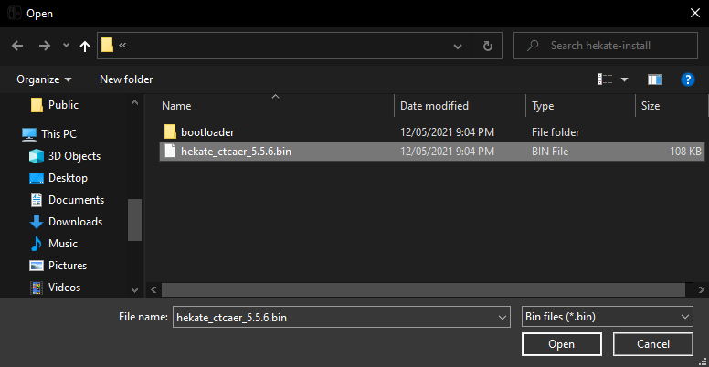

## Table of Contents

* [Introduction](../index.md)
* [Prerequisites](../prerequisites/index.md)
* [Preparing the microSD Card](../prepare-sd-card/index.md)
* [Booting into RCM](../boot-to-rcm/index.md)
* **Booting into Hekate**
* [Dumping Decryption Keys](../dump-keys/index.md)
* [Backing up Switch NAND](../nand-backup/index.md)
* [Dumping System Update Firmware](../dump-firmware/index.md)
* [Dumping Games](../dump-games/index.md)
* [Dumping Save Files](../dump-saves/index.md)
* [Rebooting the Switch Back to its Original State](../reboot-to-stock/index.md)
* [Running yuzu](../running-yuzu/index.md)
* [Mounting the microSD card to your computer in Hekate](../hekate-ums/index.md)

## Booting into Hekate

We will now boot your Nintendo Switch into Hekate, a custom bootloader.

1. Extract the `hekate_ctcaer_X.X.X.bin` file from the `hekate_ctcaer_X.X.X_Nyx_X.X.X.zip` file you downloaded from the prerequisites to any accessible directory on your computer.
2. Open the  TegraRcmGUI window. In the `Payload` tab of TegraRcmGUI, click on the folder icon and navigate to the `hekate_ctcaer_X.X.X.bin` file you extracted earlier.

    
    
3. Click on `Inject Payload` and your Switch will boot into the Hekate menu.

    
    **NOTE:** Upon first boot, Hekate prompts you to set the current date and time. This step is optional.

    
