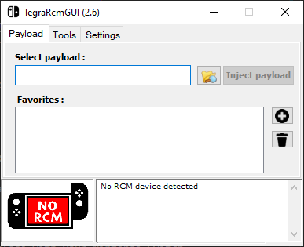
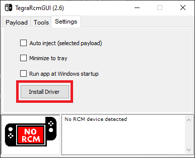
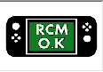

## Table of Contents

* [Introduction](/quickstart/)
* [Prerequisites](/quickstart/prerequisites/)
* [Preparing the microSD Card](/quickstart/prepare-sd-card/)
* [**Booting into RCM**](/quickstart/boot-to-rcm/)
* [Booting into Hekate](/quickstart/boot-to-hekate/)
* [Dumping Decryption Keys](/quickstart/dump-keys/)
* [Backing up Switch NAND](/quickstart/nand-backup/)
* [Dumping System Update Firmware](/quickstart/dump-firmware/)
* [Dumping Games](/quickstart/dump-games/)
* [Dumping Save Files](/quickstart/dump-saves/)
* [Rebooting the Switch Back to its Original State](/quickstart/reboot-to-stock/)
* [Running yuzu](/quickstart/running-yuzu/)
* [Mounting the microSD card to your computer in Hekate](/quickstart/hekate-ums/)

## Booting into RCM

We will now boot your Nintendo Switch into RCM mode.

1. Run the TegraRcmGUI installer you downloaded from the [prerequisites section](../prerequisites), and after installation, start the program.

    
2. In the `Settings` tab, click on `Install Driver` which will install the drivers necessary for your computer to interface with your Nintendo Switch.

    
3. After the drivers have been installed, plug your Nintendo Switch into your computer.
4. Power off your Switch while it is still connected to your computer.
5. Insert your RCM jig into the right Joy-Con slot, make sure it is seated securely at the base, and hold `VOL+` and press the `POWER` button. Nothing should happen on your Switch and you should hear a USB connection sound from your computer; if the Switch starts to turn on normally (Nintendo logo appearing on the screen), go back to the beginning of step 4 and try again.
6. If you see the Nintendo Switch icon in the lower left corner flash green and state `RCM O.K.` in TegraRcmGUI, your Switch has successfully entered RCM mode.

    
