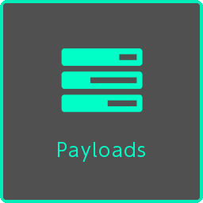
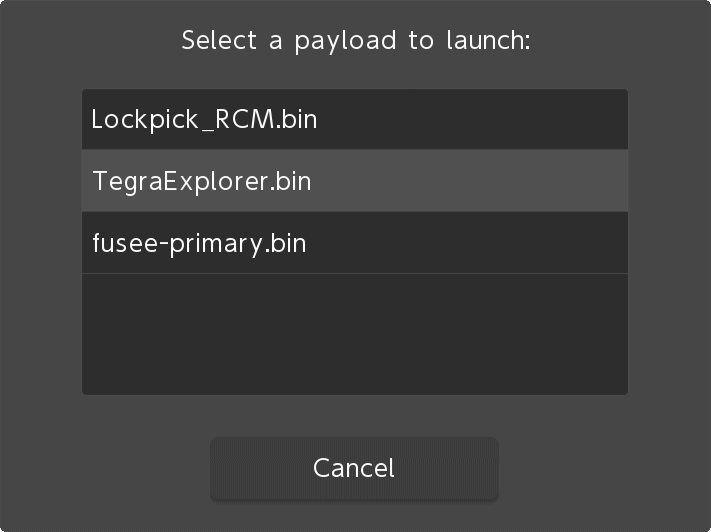
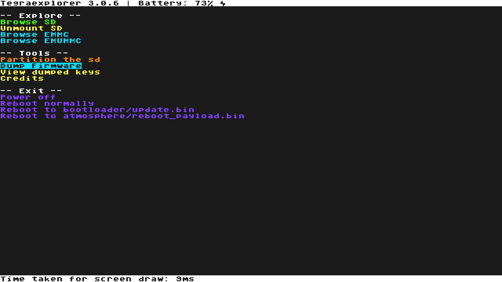
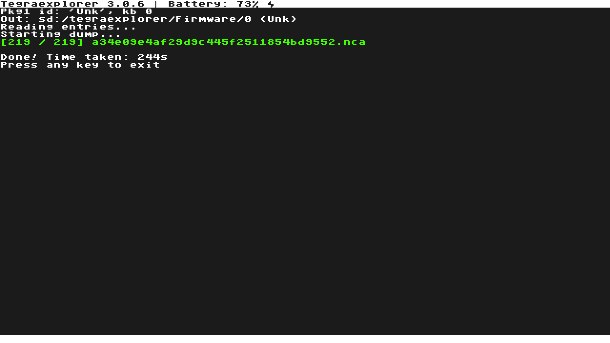

## Table of Contents

* [Introduction](/quickstart/)
* [Prerequisites](/quickstart/prerequisites/)
* [Preparing the microSD Card](/quickstart/prepare-sd-card/)
* [Booting into RCM](/quickstart/boot-to-rcm/)
* [Booting into Hekate](/quickstart/boot-to-hekate/)
* [Dumping Decryption Keys](/quickstart/dump-keys/)
* [Backing up Switch NAND](/quickstart/nand-backup/)
* [**Dumping System Update Firmware**](/quickstart/dump-firmware)
* [Dumping Games](/quickstart/dump-games/)
* [Dumping Save Files](/quickstart/dump-saves/)
* [Rebooting the Switch Back to its Original State](/quickstart/reboot-to-stock/)
* [Running yuzu](/quickstart/running-yuzu/)
* [Mounting the microSD card to your computer in Hekate](/quickstart/hekate-ums/)

## Dumping System Update Firmware

Some games such as `Mario Kart 8 Deluxe` require the use of files found inside the `Nintendo Switch System Update Firmware` to be playable. In this step, we will now dump the firmware files from your Switch for use in yuzu.

1. Boot your Nintendo Switch into [RCM mode](../boot-to-rcm) (steps 3 to 6) and make sure it is connected to your computer.
2. Boot into [Hekate](../boot-to-hekate) (steps 2 to 3).
3. When it has successfully booted into the Hekate Home menu, tap on `Payloads`. This will show a list of payloads.

    
4. Tap on `TegraExplorer.bin` in the list of payloads.

    
5. After TegraExplorer has successfully booted, navigate through the menu using the `VOL+/VOL-` buttons to highlight and select `Dump Firmware` by pressing the `POWER` button.

    
6. Once the dumping process is finished, the `.nca` files will be located in your microSD card at `sd:/tegraexplorer/Firmware/` inside a folder with a name of the firmware revision.

    
7. Press any button to return to the main menu.
8. Select the `Reboot to bootloader/update.bin` option.

    
Alternatively, you can select the `Reboot to atmosphere/reboot_payload.bin` option if the `Reboot to bootloader/update.bin` is not available.

    
You should now be booted back into Hekate.
9. [Mount the SD card to your computer in Hekate](../hekate-ums) (steps 1 to 3).
10. Navigate to your SD card drive and copy the contents in the `Firmware` folder (step 6) to `%appdata%\yuzu\nand\system\Contents\registered` in the address bar of the file explorer. If done correctly, the `registered` folder should have `219` `.nca` files as of Firmware version `12.1.0`.
11. Once you're done copying, [safely eject the SD card drive in your computer and return to the Hekate Home menu](../hekate-ums) (steps 4 to 5).
