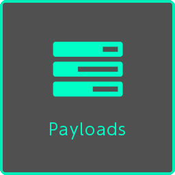
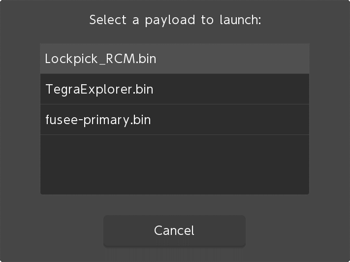
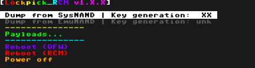
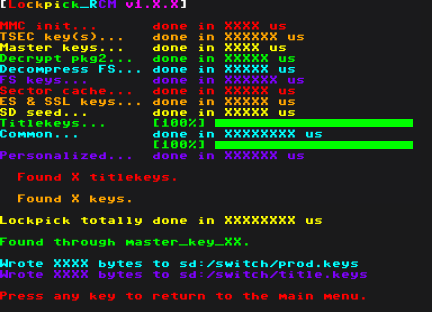

## Table of Contents

* [Introduction](../index.md)
* [Prerequisites](../prerequisites/index.md)
* [Preparing the microSD Card](../prepare-sd-card/index.md)
* [Booting into RCM](../boot-to-rcm/index.md)
* [Booting into Hekate](../boot-to-hekate/index.md)
* **Dumping Decryption Keys**
* [Backing up Switch NAND](../nand-backup/index.md)
* [Dumping System Update Firmware](../dump-firmware/index.md)
* [Dumping Games](../dump-games/index.md)
* [Dumping Save Files](../dump-saves/index.md)
* [Rebooting the Switch Back to its Original State](../reboot-to-stock/index.md)
* [Running yuzu](../running-yuzu/index.md)
* [Mounting the microSD card to your computer in Hekate](../hekate-ums/index.md)

## Dumping Decryption Keys

We will now dump your `prod.keys` and `title.keys` for decryption of your game files.

1. From the Hekate Home menu, tap on `Payloads`.

    
2. Tap on `Lockpick_RCM.bin` in the list of payloads.

    
3. After Lockpick_RCM has successfully booted, hold your console vertically. The screen should show an interface like this:

    

    **NOTE:** As of the Switch's `12.0.2` System Update, `Key generation`  should be at level `10`. If a lower level is shown, select the `Reboot (OFW)` option instead and [update the console to the latest version.](https://en-americas-support.nintendo.com/app/answers/detail/a_id/22418/~/how-to-perform-a-system-update) Once the Switch is up to date, start from the [Booting into RCM](../boot-to-rcm/index.md) section.
4. Press the `POWER` button to select `Dump from SysNAND`.
5. Lockpick_RCM will now automatically boot to `sept` and start deriving the keys. Wait for it to finish deriving the keys.
6. After Lockpick_RCM has finished deriving the keys, please make note of the location of the key files. Default is: `sd:/switch/prod.keys` and `sd:/switch/title.keys`.

    

    If things went well, Lockpick_RCM should output a message of `Found through master_key_0A`. If this is not the case, refer to the NOTE in step 3.
7. Press any button to return to the menu, then navigate with the `VOL+/VOL-` buttons to highlight and select `Payloads...` by pressing the `POWER` button.
8. Select `reboot_payload.bin` from the list of payloads. You should now be booted back into Hekate.
9. [Mount the microSD card to your computer in Hekate](../hekate-ums/index.md)
10. Navigate to your SD card drive and copy both `prod.keys` and `title.keys` to the `%YUZU_DIR%/keys` directory.
11. Once you're done copying, [safely eject the SD card drive in your computer and return to the Hekate Home menu.](../hekate-ums/index.md)
