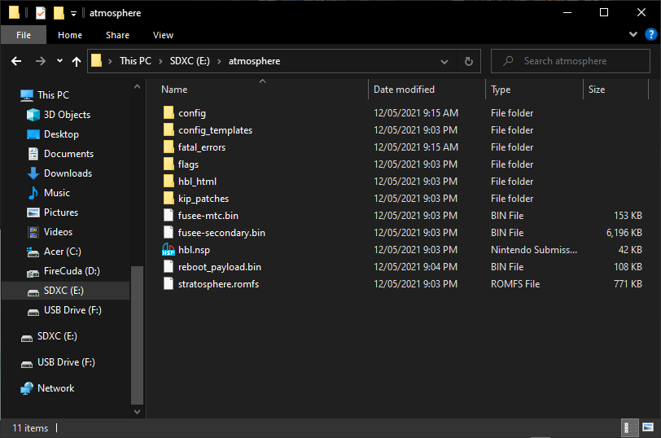
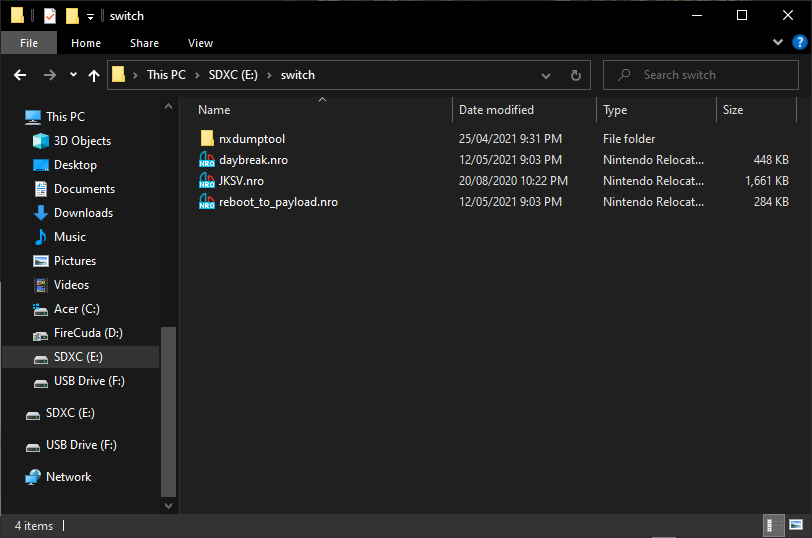

## Table of Contents

* [Introduction](../index.md)
* [Prerequisites](../prerequisites/index.md)
* **Preparing the microSD Card**
* [Booting into RCM](../boot-to-rcm/index.md)
* [Booting into Hekate](../boot-to-hekate/index.md)
* [Dumping Decryption Keys](../dump-keys/index.md)
* [Backing up Switch NAND](../nand-backup/index.md)
* [Dumping System Update Firmware](../dump-firmware/index.md)
* [Dumping Games](../dump-games/index.md)
* [Dumping Save Files](../dump-saves/index.md)
* [Rebooting the Switch Back to its Original State](../reboot-to-stock/index.md)
* [Running yuzu](running-yuzu/index.md)
* [Mounting the microSD card to your computer in Hekate](../hekate-ums/index.md)

## Preparing the microSD Card

We will now prepare the microSD card.

1. Extract the contents inside the `atmosphere-X.X.X-master-XXXXXXXX+hbl-X.X.X+hbmenu-X.X.X.zip` and `hekate_ctcaer_X.X.X_Nyx_X.X.X.zip` files into the root of your microSD card. Just drag and drop the contents, do not create any new folders.
2. Rename the `hekate_ctcaer_X.X.X.bin` file to `reboot_payload.bin` and move it into the `atmosphere` folder. Replace the file when prompted.
3. Place the `fusee-primary.bin`, `Lockpick_RCM.bin` and `TegraExplorer.bin` files into the `payloads` folder, which is inside the `bootloader` folder in your microSD card.
4. Create a folder named `nxdumptool` within the `switch` folder of your SD card and place the `nxdumptool.nro` file inside it.
5. Place the `JKSV.nro` file inside the `switch` folder.
6. Once done, eject the microSD card and insert it into your Nintendo Switch.



The root of your microSD card should look like this:

`atmosphere` folder:

`bootloader/payloads` folder:

`switch` folder:

